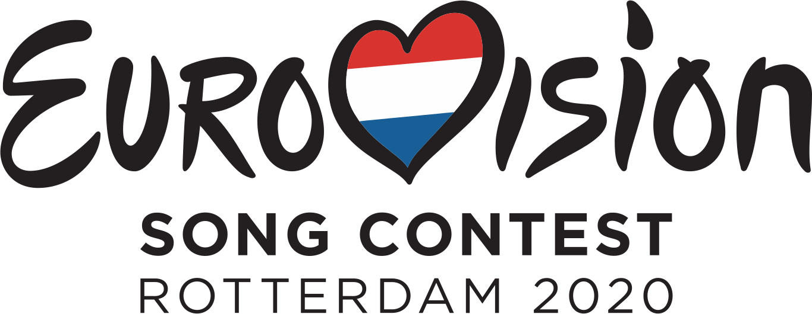

# Vote! Eurovision 2020 :eu: :netherlands:

[Read in English](https://github.com/missmay4/Eurovision-2020-Project/blob/master/README.md)

# Descripción del proyecto: 
Hola! Este es el proyecto final y personal para el Curso FP Desarrollo de Apliaciones Web del I.E.S. Clara del Rey, en el que se mostrarán todos los datos relativos a la 65ª edición de Eurovisión.

Debido a la crisis del CO-VID 19 que afecta a toda Europa, esta edicion ha sido cancelada, por lo que los datos que inicialmente se conocian para dicha celebración se usarán a modo de datos de prueba para un simulacro de dicha celebración.

Aquí se va a desarrollar una appliación web, dónde la mayor funcionalidad sera **votar** por tus favoritos, así cómo encontrar los datos relativos a los participantes de cada país y más...

## Tecnologías usadas: 
### Parte cliente: 
* [Vue JS](https://vuejs.org/)
### Parte servidor: 
* [Spring](https://spring.io/projects/spring-framework)
* [Apache Maven](https://maven.apache.org/)
* [PostgreSQL](https://www.postgresql.org/)
### Parte Diseño de interfaces web
* CSS
* [Bootstrap](https://getbootstrap.com/)
### Parte Despliegue de aplicaciones web
* Git & Github
* [Docker](https://www.docker.com/)

## Final _16/05/2020_

### Participantes

#### País anfitrión:

- [x] Países Bajos :netherlands: (_Grow - Jeangu Macrooy_)

#### Big Five:

- [x] Gran Bretaña :uk: (_My Last Breath - James Newman_)
- [x] España :es: (_Universo - Blas Cantó_)
- [x] Francia :fr: (_Mon Alliée (The Best in Me) - Tom Leeb_)
- [x] Italia :it: (_Fai Rumore - Diodato_)
- [x] Alemania :de: (_Violent Thing - Ben Dolic_)

#### Participantes de la 1º Semifinal: (_12/05/2020_)

- [ ] Macedonia del Norte :macedonia: (_You - Vasil Garvanliev_)
- [ ] Bielorrusia :belarus: (_Da Vidna - VAL_)
- [ ] Lituania :lithuania: (_On Fire - The Roop_)
- [ ] Suecia :sweden: (_Move - The Mamas_)
- [ ] Eslovenia :slovenia: (_Voda - Ana Soklič_)
- [ ] Australia :australia: (_Don’t Break Me - Montaigne_)
- [ ] Irlanda :ireland: (_Story Of My Life - Lesley Roy_)
- [ ] Rusia :ru: (_UNO - Little Big_)
- [ ] Noruega :norway: (_Attention - Ulrikke Brandstorp_)
- [ ] Chipre :cyprus: (_Running - Sandro Nicolas_)
- [ ] Croacia :croatia: (_Divlji vjetre - Damir Kedžo_)
- [ ] Azerbaiyán :azerbaijan: (_Cleopatra - Samira Efendi_)
- [ ] Malta :malta: (_All Of My Love - Destiny Chukunyere_)
- [ ] Israel :israel: (_Feker Libi - Eden Alene_)
- [ ] Ucrania :ukraine: (_Solovey - Go_A_)
- [ ] Rumania :romania: (_Alcohol You - Roxen_)
- [ ] Bélgica :belgium: (_Release Me - Hooverphonic_)

#### Participantes de la 2º Semifinal: (_14/05/2020_)

- [ ] Austria :austria: (_Alive - Vincent Bueno_)
- [ ] Moldavia :moldova: (_Prison - Natalia Gordienco_)
- [ ] Polonia :poland: (_Empires - Alicja Szemplińska_)
- [ ] San Marino :san_marino: (\_Freaky! - Senhit*)
- [ ] Serbia :serbia: (_Hasta La Vista - Hurricane_)
- [ ] Islandia :iceland: (_Think About Things - Daði & Gagnamagnið_)
- [ ] República Checa :czech_republic: (\_Kemama - Benny Cristo*)
- [ ] Grecia :greece: (_Superg!rl - Stefania Liberakakis_)
- [ ] Estonia :estonia: (_What Love Is - Uku Suviste_)
- [ ] Dinamarca :denmark: (_Yes - Ben & Tan_)
- [ ] Bulgaria :bulgaria: (_Tears Getting Sober - Victoria Georgieva_)
- [ ] Suiza :switzerland: (_Répondez-moi - Gjon's Tears_)
- [ ] Finlandia :finland: (_Looking Back - Aksel Kankaanranta_)
- [ ] Armenia :armenia: (_Chains on You - Athena Manoukian_)
- [ ] Letonia :latvia: (_Still Breathing - Samanta Tīna_)
- [ ] Georgia :georgia: (_Take Me As I Am - Tornike Kipiani_)
- [ ] Portugal :portugal: (_Medo de Sentir - Elisa Silva_)
- [ ] Albania :albania: (_Fall From The Sky - Arilena Ara_)

#### No clasificados:
