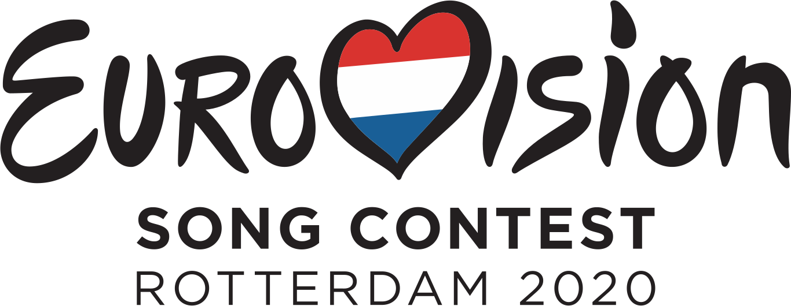

# Vote! Eurovision 2020 :eu: :netherlands:

[You can try the app here](https://vote-eurovision2020.herokuapp.com/)

[Leer en español](https://github.com/missmay4/Eurovision-2020-Project/blob/master/README-ES.md)

Hello! This is a personal and final project made for Web Development FP Course in I.E.S Clara del Rey, in which all the data relating to the 65th edition of Eurovision are shown.

Due to the CO-VID 19 crisis affecting the whole of Europe, this edition has been canceled, so the data that may be known for said celebration will be used in a test data mode for a simulation of said celebration.

Here we'll develop a web application, where most of the function will be **vote** for your favorites, as well as find the data relative to the participants of each country and more...

## Tecnologías usadas: 
### Client: 
* [Vue JS](https://vuejs.org/)
### Server: 
* [Spring](https://spring.io/projects/spring-framework)
* [Apache Maven](https://maven.apache.org/)
* [PostgreSQL](https://www.postgresql.org/)
### Web Interface
* CSS
* [Bootstrap](https://getbootstrap.com/)
### Web Deployment
* Git & Github
* [Docker](https://www.docker.com/)

## Grand Final ~~_16/05/2020_~~

### Participants

#### Host Country:

- [x] Netherlands :netherlands: (_Grow - Jeangu Macrooy_)

#### Big Five:

- [x] Great Britain :uk: (_My Last Breath - James Newman_)
- [x] Spain :es: (_Universo - Blas Cantó_)
- [x] France :fr: (_Mon Alliée (The Best in Me) - Tom Leeb_)
- [x] Italy :it: (_Fai Rumore - Diodato_)
- [x] Germany :de: (_Violent Thing - Ben Dolic_)

#### 1st Semifinal Participants: ~~(_12/05/2020_)~~

- [ ] Sweden :sweden: (_Move - The Mamas_)
- [ ] Belarus :belarus: (_Da Vidna - VAL_)
- [ ] Australia :australia: (_Don’t Break Me - Montaigne_)
- [ ] North Macedonia :macedonia: (_You - Vasil Garvanliev_)
- [ ] Slovenia :slovenia: (_Voda - Ana Soklič_)
- [ ] Lithuania :lithuania: (_On Fire - The Roop_)
- [ ] Ireland :ireland: (_Story Of My Life - Lesley Roy_)
- [ ] Russia :ru: (_UNO - Little Big_)
- [ ] Belgium :belgium: (_Release Me - Hooverphonic_)
- [ ] Malta :malta: (_All Of My Love - Destiny Chukunyere_)
- [ ] Croatia :croatia: (_Divlji vjetre - Damir Kedžo_)
- [ ] Azerbaijan :azerbaijan: (_Cleopatra - Samira Efendi_)
- [ ] Cyprus :cyprus: (_Running - Sandro Nicolas_)
- [ ] Norway :norway: (_Attention - Ulrikke Brandstorp_)
- [ ] Israel :israel: (_Feker Libi - Eden Alene_)
- [ ] Romania :romania: (_Alcohol You - Roxen_)
- [ ] Ukraine :ukraine: (_Solovey - Go_A_)

#### 2nd Semifinal Participants: ~~(_14/05/2020_)~~

- [ ] Greece :greece: (_Superg!rl - Stefania Liberakakis_)
- [ ] Estonia :estonia: (_What Love Is - Uku Suviste_)
- [ ] Austria :austria: (_Alive - Vincent Bueno_)
- [ ] Moldova :moldova: (_Prison - Natalia Gordienco_)
- [ ] San Marino :san_marino: (_Freaky! - Senhit_)
- [ ] Czech Republic :czech_republic: (_Kemama - Benny Cristo_)
- [ ] Serbia :serbia: (_Hasta La Vista - Hurricane_)
- [ ] Poland :poland: (_Empires - Alicja Szemplińska_)
- [ ] Iceland :iceland: (_Think About Things - Daði & Gagnamagnið_)
- [ ] Switzerland :switzerland: (_Répondez-moi - Gjon's Tears_)
- [ ] Denmark :denmark: (_Yes - Ben & Tan_)
- [ ] Albania :albania: (_Fall From The Sky - Arilena Ara_)
- [ ] Finland :finland: (_Looking Back - Aksel Kankaanranta_)
- [ ] Armenia :armenia: (_Chains on You - Athena Manoukian_)
- [ ] Portugal :portugal: (_Medo de Sentir - Elisa Silva_)
- [ ] Bulgaria :bulgaria: (_Tears Getting Sober - Victoria Georgieva_)
- [ ] Georgia :georgia: (_Take Me As I Am - Tornike Kipiani_)
- [ ] Latvia :latvia: (_Still Breathing - Samanta Tīna_)

#### Not Qualified:
